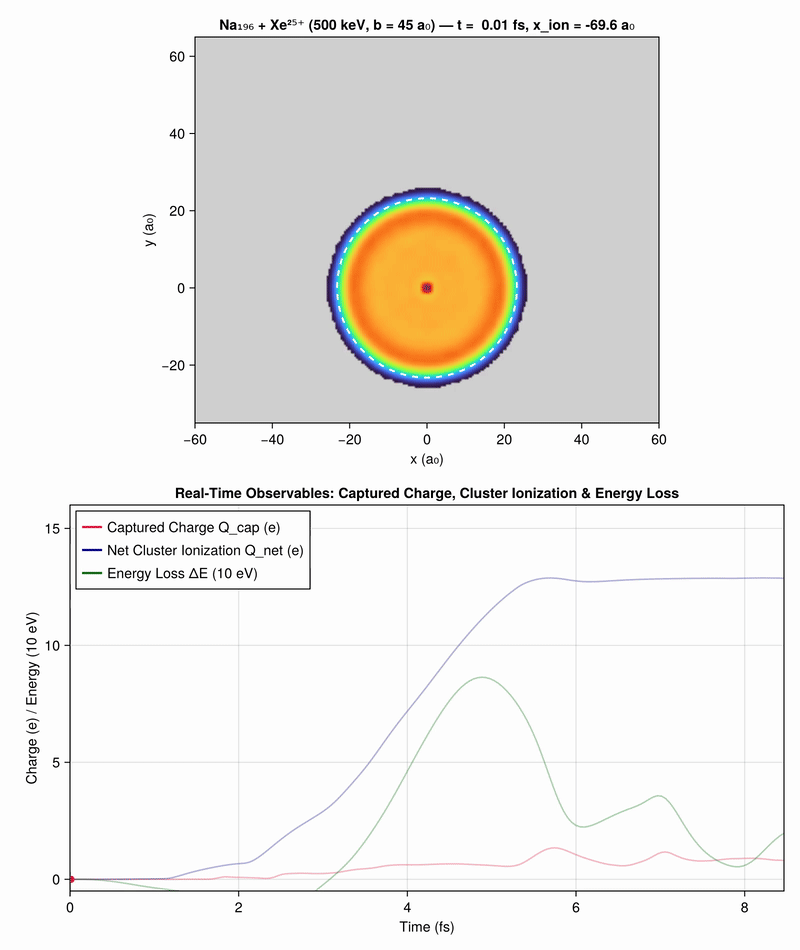

# Vlasov.jl

The electron dynamics of a sodium cluster struck by a fast ion, by the
pseudo-particle (Vlasov) method — a Julia port of the Fortran 77 code written
for L. Plagne's PhD thesis, prepared at **CEA-Grenoble** under the supervision
of **C. Guet** (1996–1998). The original still compiles and runs, and serves as
the oracle the port is kept honest against.



**Na₁₉₆ + Xe²⁵⁺, 500 keV, impact parameter 45 a₀, 80 million pseudo-particles.**
The ion grazes the cluster; its field tears an electron bridge out of the
valence cloud and carries part of it away — the 1997 Springer study, at two
hundred times the particle count the machines of the day allowed.

**The one command below computes that same collision with 8 million**, in two
minutes, and writes its own film: the same picture, with ten times fewer
particles and the noise that follows. The 80-million version above is a separate
script, `scripts/film_xenon_80M.jl` — eleven gigabytes of device memory and a
different afternoon.

---

## Running your first collision

### 1. Install Julia

This is a Julia package, so the language comes first. The official installer is
**juliaup**, which needs no privileges:

```sh
curl -fsSL https://install.julialang.org | sh                      # macOS, Linux
winget install --name Julia --id 9NJNWW8PVKMN -e -s msstore        # Windows
```

Close the terminal, open a new one, and check it answers:

```sh
julia --version        # 1.11 or newer; developed and tested on 1.12 and 1.13
```

If Julia was already installed and answers something older, `juliaup self update
&& juliaup update` moves it on. The environments here declare their path
dependencies with `[sources]`, which 1.10 does not understand — and says so by
claiming a package "does not seem to be installed", which sends you looking in
the wrong place entirely.

### 2. Get the code, and let it look at your machine

```sh
git clone https://github.com/LaurentPlagne/Vlasov.jl.git
cd Vlasov.jl
julia scripts/setup.jl
```

`setup.jl` looks for an Apple GPU, an NVIDIA card and a display, and builds
`run/` — the one environment *this* machine needs. A few minutes the first time,
nothing afterwards:

```
Looking at this machine:
  Apple Silicon      yes
  nvidia-smi         not found
  display            yes

Building /Users/you/Vlasov.jl/run:
  Vlasov ... ok
  Metal ... ok
  AppleAccelerate ... ok
  GLMakie ... ok
```

`Metal` and `CUDA` cannot share a `Project.toml`: each installs artifacts the
other platform has no build for. The choice has to be made somewhere, and it is
better made by looking than by asking you to know.

### 3. Run it

One command, the same on every machine. It computes the collision, prints what
is happening, and writes the film:

```sh
julia --project=run -t auto scripts/xenon.jl
```

```
path: GPU (Metal) + AppleAccelerate, 10 threads | renderer: GLMakie, heatmap
Na196 + Xe25+, 500 keV, b = 45 a0 | 8.0e+06 particles, grid 130^3
built in 18.5 s

   step     t (fs)    x_ion (a0)   q(<8 a0)        out    ms/step
     50       0.60        -60.0      0.000          0      100.1
    ...
    350       4.23         -0.0      0.635      74061       94.1
    ...
    700       8.47         70.0      0.840     216829      141.5

700 steps in 69.5 s — 99.3 ms/step, plus 6.8 s reading 176 frames back
charge carried away by the ion: 0.840 electrons
wrote /Users/you/Vlasov.jl/film_xenon.mp4 — 176 frames in 3.9 s (44.8 frames/s)
wrote /Users/you/Vlasov.jl/film_xenon.gif
```

Two minutes and twelve seconds from nothing, on a ten-core M1 Max. `-t auto`
hands Julia every core; without it the host-side loops run on one.

**`q(<8 a0)` is the physics**: the charge within 8 a₀ of the ion, in electrons.
It starts at zero, rises as the ion passes, peaks above one, and settles at what
the ion carries off. `out` counts the particles that have left the fine grid —
not lost, the coarse grid carries them, and watching it climb is watching the
ion strip the cluster.

### Three options, and nothing else to learn

| | | default |
|---|---|---|
| `--particules=N` | pseudo-particles | 8×10⁶ with a GPU, 6×10⁵ without |
| `--nfine=n` | intervals of the fine grid — **even** | 64, i.e. a 130³ grid |
| `--cpu` / `--gpu` | force the path | take whatever is there |

```sh
julia --project=run -t auto scripts/xenon.jl --particules=100000 --nfine=28
```

is the quickest whole crossing — **a minute**, film included, and the capture
still comes out at 1.0 electron.

Besides the film, the run leaves `xenon_snapshots.png` and
`xenon_data_cache.jls`, which `scripts/render_xenon_glmakie.jl` redraws without
recomputing anything. All of it at the root of the repository, all gitignored.

| from nothing, no cache | whole command |
|---|---:|
| M1 Max, 8×10⁶ particles | **2 min 12** |
| RTX 4070, 8×10⁶ | 2 min 15 |
| 10 CPU cores, 6×10⁵ | 3 min 31 |

### Two vendors, the same physics

The same kernels on an M1 Max and on an RTX 4070, over the whole crossing at
8×10⁶ particles, measured the same afternoon:

| | M1 Max, 32-core GPU | RTX 4070, 12 GB |
|---|---:|---:|
| charge carried away | 0.840 e | **0.842 e** |
| ms/step, averaged over the crossing | 99.3 | **76.4** |
| 700 steps | 69.5 s | **53.5 s** |

Two independent vendors agreeing to the third digit is the strongest statement
this port can make about itself — and the third digit is where agreement stops
meaning much: two runs on the *same* card differ by as much, `Float32` atomics
not committing in the same order twice.

> [!WARNING]
> **ROCm and oneAPI have never been run**, and CUDA only on two cards. Getting
> there took five bugs that Apple's unified memory had been hiding, the worst of
> which silently froze the cloud — the capture curve read 0.000 for an entire
> crossing. Please report the next one.

### The other environments

`run/` is generated and gitignored, and so is every `Manifest.toml` here: one
resolved on a Mac pins versions another machine cannot replay. Run `setup.jl`
again whenever the machine changes.

`gpu/`, `cuda/`, `viz/` and `docs/` are what the repository's **own** scripts and
its CI use — the campaign runs, the thesis figures, the site. A first run needs
none of them.

---

## How long, and how big

Measured with the command above on one machine — **Apple M1 Max, 32-core GPU,
64 GB unified, 10 CPU threads** — so read the shape of it, not the absolute
numbers:

| path | particles | grid | ms/step | whole crossing |
|---|---:|---|---:|---:|
| CPU, 10 threads | 5×10⁵ | 90³ | 160 | **112 s** |
| GPU | 2×10⁶ | 90³ | 37 | ≈ 30 s |
| **GPU** | **8×10⁶** | **130³** | **99** | **70 s** |
| GPU | 3.2×10⁷ | 130³ | 240 | ≈ 3 min |
| GPU | 8×10⁷ | 222³ | 588 | ≈ 8 min |

The two bold rows are complete 700-step runs; the others are 200-step
measurements, and the crossing takes more than the multiplication suggests —
the step gets slower as the cloud spreads over more cells, 100 ms at the start
against 141 at the end of the bold row. None of these includes the film, which
is a fixed four seconds.

**What fits in a given graphics memory** follows from two numbers measured on
the live objects, one per pseudo-particle and one per grid point:

```
device memory ≈ 128 bytes × particles  +  91 bytes × (2·nfine + 2)³
```

| graphics memory | particles at 130³ | at 222³ |
|---|---:|---:|
| 4 GB | 22 M | 15 M |
| 8 GB | 53 M | 46 M |
| 16 GB | 115 M | 109 M |
| 24 GB | 178 M | 172 M |
| 64 GB unified (Apple) | ≈ 350 M | ≈ 340 M |

Checked on a discrete card, which the table had only reasoned about: 3×10⁷
particles on 130³ asks 3.78 GiB by the formula and **took 3.91** on an RTX 5060,
3.4 % over. Leave a gigabyte to the driver.

**8 million is the safe first number** — one gigabyte of device memory, seventy
seconds of stepping, and it fits everywhere. The rest of the accounting, and why
the Apple row is bounded by the *construction* rather than by the run, is in
[the device path](docs/src/device.md).

> [!NOTE]
> Scale by a card's **bandwidth**, not its FLOP rating: the kernels are bound by
> memory traffic and atomics, not arithmetic. The RTX 4070 makes the point — it
> beats an M1 Max by ×4.9 on the Poisson solve and loses to it on the sort.

### Choosing a grid

⚠️ **The grid comes in pairs.** The coarse mesh must carry exactly as many basis
functions as the fine one, so `--nfine` must be **even**, and the two coarse
parameters are derived from it rather than given:

| `--nfine` | grid | what it is for |
|---|---|---|
| 28 | 58³ | a quick look, a minute of laptop CPU |
| 44 | 90³ | a lighter GPU run |
| **64** | **130³** | **the default** |
| 110 | 222³ | production, 8×10⁷ particles |

An odd `nfine` leaves the two meshes one basis function apart, and the run stops
on `DimensionMismatch: ρ must cover the whole collocation grid`.

---

## Documentation

**[laurentplagne.github.io/Vlasov.jl](https://laurentplagne.github.io/Vlasov.jl/)**
— fourteen pages, and the figures on them are *computed* when the site is
built, not checked in.

| page | what it answers |
|---|---|
| [Principles](docs/src/principles.md) | what equations are being solved, and why this model |
| [Numerics](docs/src/numerics.md) | splines, collocation, the tensor Poisson solver, Verlet |
| [Architecture](docs/src/architecture.md) | how the code is laid out, and what one step does |
| [The device path](docs/src/device.md) | what runs on the GPU, what it costs in memory, and why the cloud changed shape |
| [Validation](docs/src/validation.md) | how we know it is right — and where the original was not |
| [Performance](docs/src/performance.md) | where the time goes, and what was done about it |
| [The original code](docs/src/history.md) | the 43 Fortran versions, and which one is the target |

Those links go to the Markdown sources, which GitHub renders directly; the
built site is prettier and has the cross-references. To build it yourself:

```sh
julia --project=docs -e 'using Pkg; Pkg.instantiate()'
julia --project=docs docs/make.jl        # a few minutes: it runs the physics
open docs/build/index.html
```

## What else is here

| | |
|---|---|
| `scripts/` | the thesis figures, the films, the profiles and the benchmarks |
| `ref/` | the original Fortran, its data, and the thesis's published curves |
| [`lpthese2.pdf`](lpthese2.pdf) | the thesis itself (CEA-Grenoble, 1998) — the physics this code is the instrument of |
| `test/` | 4824 tests — `julia --project=. -e 'include("test/runtests.jl")'` |

⚠️ The measurement log under `docs/*.md` — as opposed to `docs/src/` — is in
French and is **not** part of the site: it is the lab notebook, it keeps the raw
numbers and the reasoning behind every decision, and the site quotes from it
what matters.

## Licence

MIT — see [LICENSE.md](LICENSE.md).
