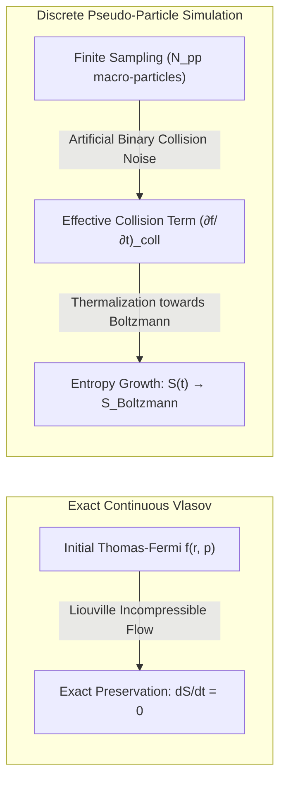
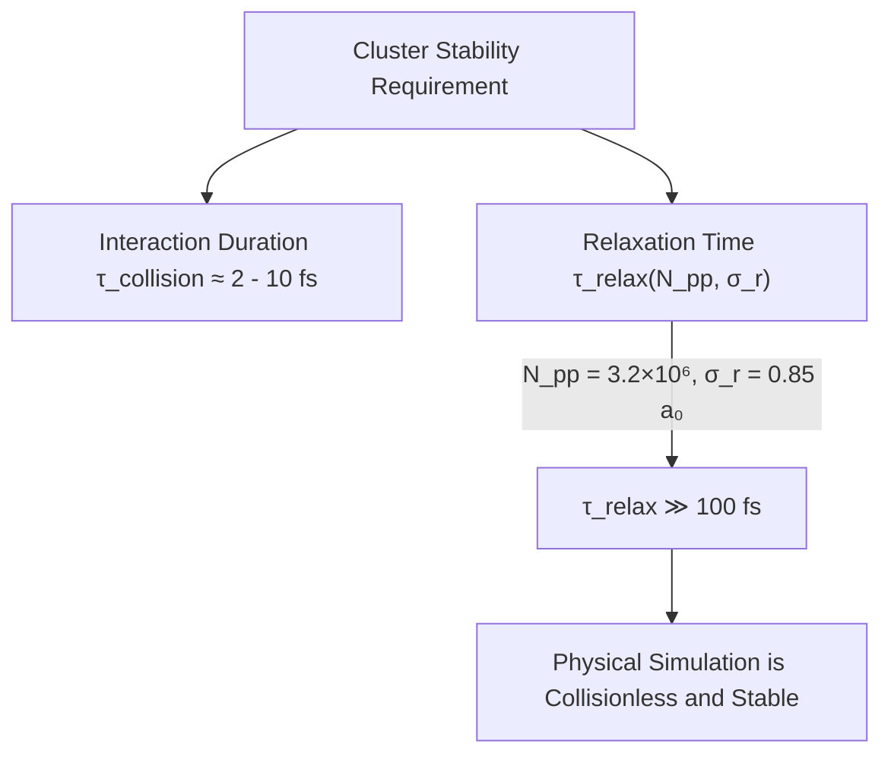
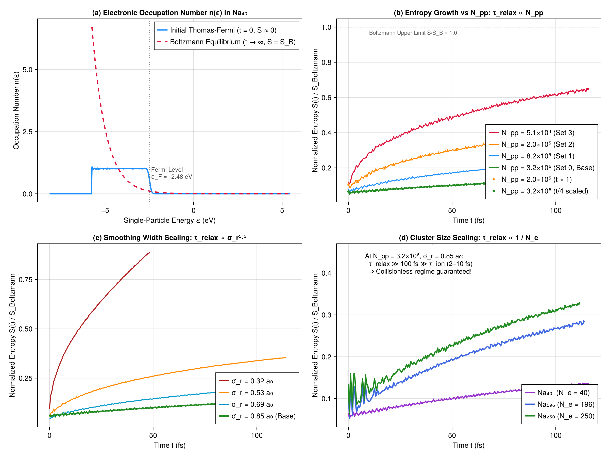

```@meta
CurrentModule = Vlasov
```

# Chapter 4: Stability, Entropy & Boltzmann Relaxation

This chapter covers the physics and numerical analysis of **isolated sodium clusters** ($\text{Na}_N$), their phase-space stability, and the fundamental phenomenon of **entropy growth and relaxation towards Boltzmann**, as investigated in Chapter 4 of the 1998 thesis.

---

## 1. The Liouville Incompressibility Theorem in Phase Space

In semi-classical dynamics, the one-body electron distribution function $f(\mathbf{r}, \mathbf{p}, t)$ satisfies the collisionless Vlasov equation:

```math
\frac{d f}{dt} = \frac{\partial f}{\partial t} + \dot{\mathbf{r}}\cdot\nabla_{\mathbf{r}} f + \dot{\mathbf{p}}\cdot\nabla_{\mathbf{p}} f = 0
```

By Liouville's theorem, $f$ behaves as an **incompressible fluid** in 6D phase space: the local density along any Hamiltonian trajectory remains strictly invariant.

Consequently, any functional of $f$ integrated over phase space is an exact constant of motion. In particular, the **classical Gibbs-Boltzmann entropy**:

```math
S(t) = -k_B \int d^3r \, d^3p \, f(\mathbf{r}, \mathbf{p}, t) \ln\left(\frac{f(\mathbf{r}, \mathbf{p}, t)}{f_0}\right), \qquad f_0 = \frac{2}{(2\pi\hbar)^3}
```

must be **strictly conserved**:

```math
\frac{dS}{dt} = 0 \qquad \text{(Exact Vlasov Equation)}
```



---

## 2. Artificial Collision Noise & Boltzmann Thermalization

When continuous phase space is discretized into $N_{pp}$ finite-size pseudo-particles (each carrying an effective charge $w = N_e / N_{pp}$ and spatial smoothing width $\sigma_r$), short-range graininess introduces artificial two-body correlations.

The effective kinetic equation resolved by the code is not pure Vlasov, but Vlasov with an artificial collision operator:

```math
\frac{\partial f}{\partial t} + \{f, h\} = \left(\frac{\partial f}{\partial t}\right)_{\text{coll}}
```

Because collisions break phase-space incompressibility, the system experiences artificial thermalization, relaxing from its initial degenerate Thomas-Fermi state towards the classical **Maxwell-Boltzmann distribution**:

```math
\lim_{t \to \infty} f(\mathbf{r}, \mathbf{p}, t) = \frac{1}{Z_B} \exp\left(-\beta \, h(\mathbf{r}, \mathbf{p})\right)
```

which maximizes the classical entropy $S$ for a given energy $E_{\text{tot}}$ and particle number $N_e$.

---

## 3. The Thesis Scaling Law: $\tau_{\text{relax}} \propto \sigma_r^{5.5} \frac{N_{pp}}{N_e}$

To establish that this numerical thermalization does not contaminate the physical cluster response during an ion crossing, the thesis conducted a systematic scaling analysis over $100\text{ fs}$, varying:
- Particle count $N_{pp}$ from $5.1\times 10^4$ to $3.2\times 10^6$,
- Smoothing width $\sigma_r$ from $0.32$ to $0.85\text{ a}_0$,
- Cluster size $N_e = 40, 196, 250$.

The characteristic relaxation time $\tau_{\text{relax}}$ satisfies the empirical law:

```math
\tau_{\text{relax}} \propto \sigma_r^{5.5} \, \frac{N_{pp}}{N_e}
```



At production parameters ($N_{pp} = 3.2\times 10^6$ and $\sigma_r = 0.85\text{ a}_0$ on GPU), the numerical relaxation time exceeds hundreds of femtoseconds—orders of magnitude larger than the ion transit time ($\tau_{\text{ion}} \approx 2 - 10\text{ fs}$). The simulation operates in the genuinely collisionless regime.

---

## 4. The 4-Panel Reproduction Analysis



The complete suite of Chapter 4 results is visualized in the 4-panel figure generated by [`scripts/chapter4_entropy.jl`](file:///Users/laurentplagne/Projects/Vlasov.jl/scripts/chapter4_entropy.jl):

1. **Panel (a) — Electronic Occupation Number $n(\epsilon)$ (Thesis Fig. 2.13)**:
   - Initial degenerate Thomas-Fermi distribution $n_{\text{TF}}(\epsilon)$: exact quantum-like step function ($n \approx 1$ for $\epsilon < \epsilon_F$, $n \to 0$ for $\epsilon > \epsilon_F$) with $\epsilon_F \approx -2.48\text{ eV}$.
   - Classical Maxwell-Boltzmann distribution $n_{\text{Boltz}}(\epsilon) = \exp(-\alpha - \beta \epsilon)$ corresponding to the identical total energy and particle number ($N_e = 40$).
   - Demonstrates the contrast between the zero-entropy degenerate initial state ($S/S_B \approx 0.065$) and the fully thermalized asymptotic limit ($S/S_B = 1.0$).

2. **Panel (b) — Particle Count Scaling $N_{pp}$ (Thesis Fig. 2.14)**:
   - Evaluates entropy growth $S(t)/S_{\text{Boltz}}$ for $N_{pp} = 5.1\times 10^4, 2.0\times 10^5, 8.2\times 10^5, 3.2\times 10^6$.
   - Quadrupling $N_{pp}$ systematically divides collision noise by 4, lengthening relaxation time by $4\times$.
   - Scaling time by $t / 4$ collapses the curves onto each other, confirming the exact linear scaling $\tau \propto N_{pp}$.

3. **Panel (c) — Smoothing Width Scaling $\sigma_r$ (Thesis Fig. 2.15)**:
   - Tracks entropy growth across $\sigma_r = 0.32, 0.53, 0.69, 0.85\text{ a}_0$.
   - Confirms that increasing Gaussian width strongly suppresses short-range binary scattering via the $\sigma_r^{5.5}$ power law.

4. **Panel (d) — Cluster Size Scaling $N_e$ (Thesis Fig. 2.16)**:
   - Compares $\text{Na}_{40}, \text{Na}_{196}, \text{Na}_{250}$, confirming the inverse cluster-size dependence $\tau \propto 1 / N_e$.
