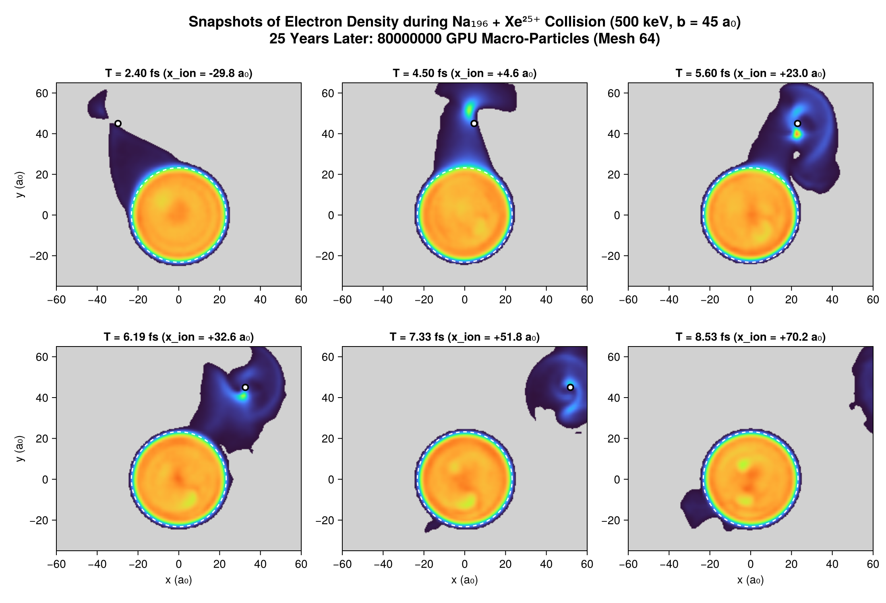
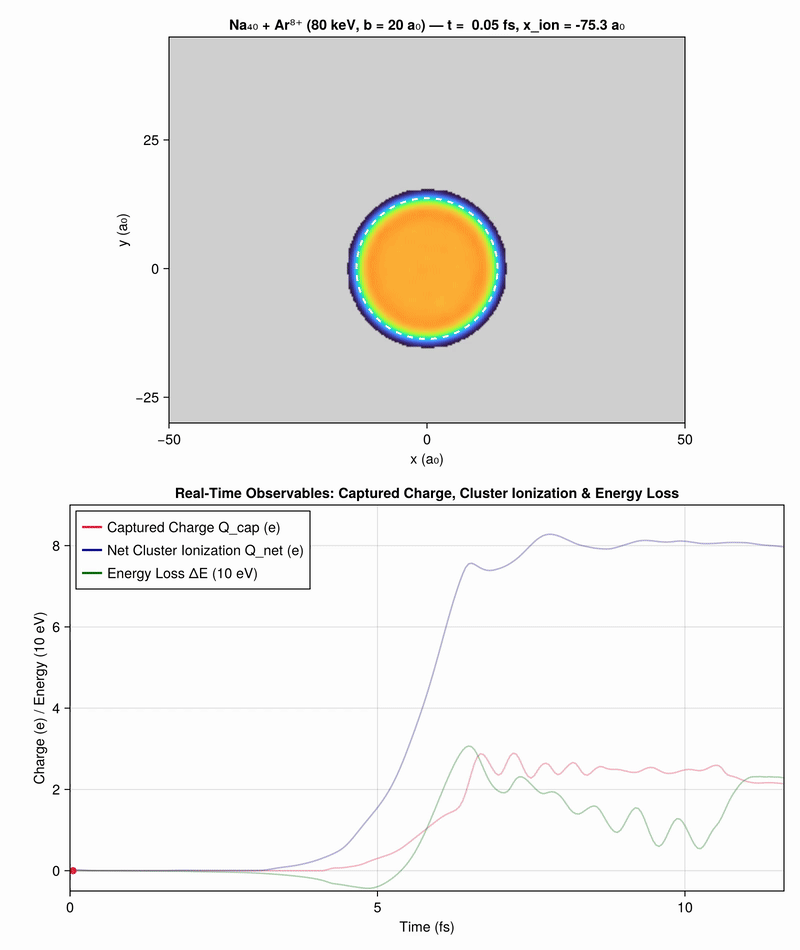
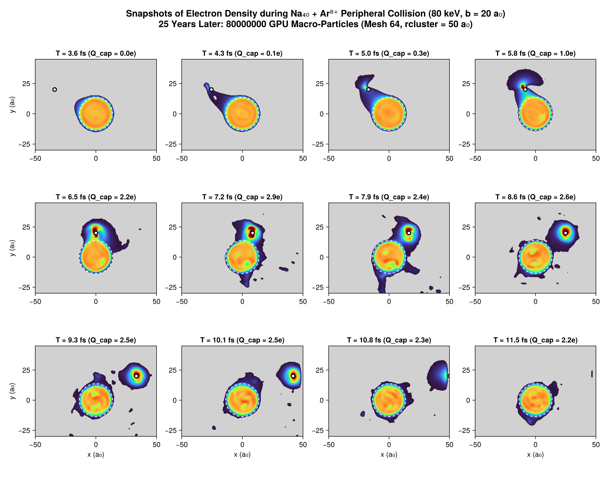

```@meta
CurrentModule = Vlasov
```

# Chapter 5: Peripheral Collisions with Highly Charged Ions

This chapter details the physical phenomenology, modeling, and simulation of **peripheral collisions between sodium clusters and multiply charged ions** ($\text{Xe}^{25+}$, $\text{Ar}^{8+}$), as presented in Chapter 4 of the 1998 thesis and the contemporary Springer 1997 publication.

---

## 1. Physical Motivation: The Rayleigh Critical Charge

A charged metallic cluster becomes unstable when electrostatic Coulomb repulsion overcomes the cluster's cohesive surface energy. For a macroscopic conducting droplet, Lord Rayleigh calculated the classical critical charge:

```math
Q_c(N) \propto N^{1/2}
```

Determining the critical charge of cold, microscopic metallic clusters provides insight into the transition between microscopic quantum mechanics and macroscopic electrostatics.

To produce **highly charged, weakly excited** clusters without fragmenting them through violent frontal collisions, experiments deploy **peripheral collisions** ($b > R_{\text{cluster}}$) using highly charged heavy ions (e.g. $\text{Xe}^{25+}$, $\text{Ar}^{8+}$).

```mermaid
graph LR
    subgraph Collision Geometry
        I["Incoming Multicharged Ion (v_P, impact parameter b)"] -->|"Coulomb Saddle Dip"| P["Closest Approach (x = 0)"]
        P -->|"Exit with Bound Electrons"| D["Outgoing Ion (Hollow Atom State)"]
    end
    subgraph Cluster Response (Na_N)
        C["Valence Electron Cloud"] -->|"Resonant Tunneling / Spillover"| E["Electron Bridge Formation"]
        E -->|"Capture"| D
        E -->|"Continuum Emission"| F["Multi-Ionization Q_net"]
        C -->|"Coherent Dipole Kick"| G["Surface Plasmon Oscillation"]
    end
```

---

## 2. Xenon Peripheral Collision Movie: $\text{Na}_{196} + \text{Xe}^{25+}$ ($500\text{ keV}$, $b = 45\text{ a}_0$)

In the Springer 1997 study (*Dynamics of clusters in collision with multicharged ions*), a high-energy multicharged Xenon ion ($\text{Xe}^{25+}$, $E = 500\text{ keV}$, velocity $v_P = 0.40\text{ a.u.}$) grazes a large sodium cluster $\text{Na}_{196}$ ($R_{\text{cluster}} \approx 22.8\text{ a}_0$) at an impact parameter $b = 45.0\text{ a}_0$.

### 25 ans plus tard : Simulation ultra-convergée à 80 millions de macro-particules

Grâce à l'accélérateur GPU Metal et aux 10,4 Go de mémoire unifiée sur Apple Silicon, la simulation est portée à **80 millions de macro-particules** (contre 400 000 en 1998 et 8 millions à l'étape intermédiaire) :


*(Vidéo MP4 haute définition disponible à `assets/film_xenon_80M.mp4`)*

#### Planche chronologique 6 panneaux (reproduction ultra-résolue de Springer 1997 `xenon40.ps`)

La figure ci-dessous reproduit la séquence historique aux 6 instants clés ($t = 2.40, 4.50, 5.60, 6.19, 7.33, 8.53\text{ fs}$) avec un niveau de résolution continu sans précédent :



*(L'étape intermédiaire à 8 millions de particules reste archivée dans [`assets/xenon_snapshots.png`](assets/xenon_snapshots.png) et [`assets/film_xenon.gif`](assets/film_xenon.gif))*

### Principaux phénomènes physiques :
1. **Formation du pont électronique ($t \approx 2.5 - 3.8\text{ fs}$)**:
   Le champ coulombien intense abaisse la barrière de potentiel sous le niveau de Fermi de l'agrégat, extrayant un bras continu d'électrons vers le projectile.
2. **Capture en atome creux (*Hollow Atom*) ($t \approx 3.8 - 5.0\text{ fs}$)**:
   Les électrons se stabilisent en orbites de Rydberg autour de l'ion rapide ($Q_{\text{cap}} \approx 0.8 - 1.3\,e$).
3. **Multi-ionisation et plasmon dipolaire ($t \ge 6.0\text{ fs}$)**:
   L'agrégat perd $\approx 13$ électrons ($Q_{\text{net}} = +12.87\,e$), laissant un agrégat froid fortement chargé $\text{Na}_{196}^{13+}$ en oscillation plasmonique dipolaire.

---

## 3. Argon Reference Collision: $\text{Na}_{40} + \text{Ar}^{8+}$ ($80\text{ keV}$, $b = 20\text{ a}_0$)

La collision périphérique de référence étudiée dans le Chapitre 4 de la thèse de 1998 est $\text{Na}_{40} + \text{Ar}^{8+}$ :
- Cible : agrégat neutre $\text{Na}_{40}$ ($r_{\text{jel}} = 13.68\text{ a}_0$).
- Projectile : ion $\text{Ar}^{8+}$ ($M \approx 73\,446\text{ u.a.}$, $E = 80\text{ keV}$, vitesse $v_P = 0.28\text{ u.a.}$).
- Paramètre d'impact : $b = 20.0\text{ a}_0$ ($b / r_{\text{jel}} \approx 1.5$).
- Pas de temps : $\Delta t = 0.5\text{ u.a.}$ ($\approx 0.012\text{ fs}$).

### 25 ans plus tard : Simulation ultra-convergée à 80 millions de macro-particules

La dynamique complète sur 960 pas de temps ($11.6\text{ fs}$) a été calculée avec **80 millions de macro-particules** :



#### Planche chronologique 12 panneaux (reproduction ultra-résolue de la Fig. 4.1 / `Fsnap1.ps` de la thèse)

Les 12 instantanés ci-dessous suivent la déformation de la densité électronique de $\text{Na}_{40}$ aux instants historiques exacts de $T = 3.6\text{ fs}$ à $11.5\text{ fs}$ :



*(L'étape intermédiaire à 8 millions de particules reste archivée dans [`assets/argon_snapshots.png`](assets/argon_snapshots.png) et [`assets/film_argon.gif`](assets/film_argon.gif))*

### Évolution des charges et observables :


### Main Observables:
1. **Captured electronic charge $Q_{\text{cap}}(t)$**:
   Measured via [`enclosed_charge`](@ref) within a sphere of radius $R = 5\text{ a}_0$ or $8\text{ a}_0$ around the ion.
2. **Cluster Net Ionization $Q_{\text{cluster}}(t)$**:
   Deficit of electrons within the cluster volume, leaving the cluster in a net charged state $\text{Na}_{40}^{Q+}$ ($Q_{\text{final}} \approx +6.5$).
3. **Cluster Excitation Energy $E_{\text{exc}}$**:
   Residual electronic internal energy after the projectile exits, dominated by the dipole surface plasmon mode.

---

## 4. Comparison with Over-the-Barrier (OBM / DOBM) and Quantum Models

The thesis benchmarks the semi-classical Vlasov simulations against:
- **Classical Over-The-Barrier Model (OBM)**: predicts electron transfer when the Coulomb saddle point between cluster and ion drops below the Fermi level $\epsilon_F$.
- **Dynamic Over-The-Barrier Model (DOBM)**: accounts for the finite velocity of the projectile and dynamic barrier deformation.
- **Quantum TDLDA calculations** (K. Yabana): confirms that the semi-classical phase-space distribution $f(\vec{r}, \vec{p}, t)$ accurately captures multi-electron transfer rates without spurious quantum suppression.
