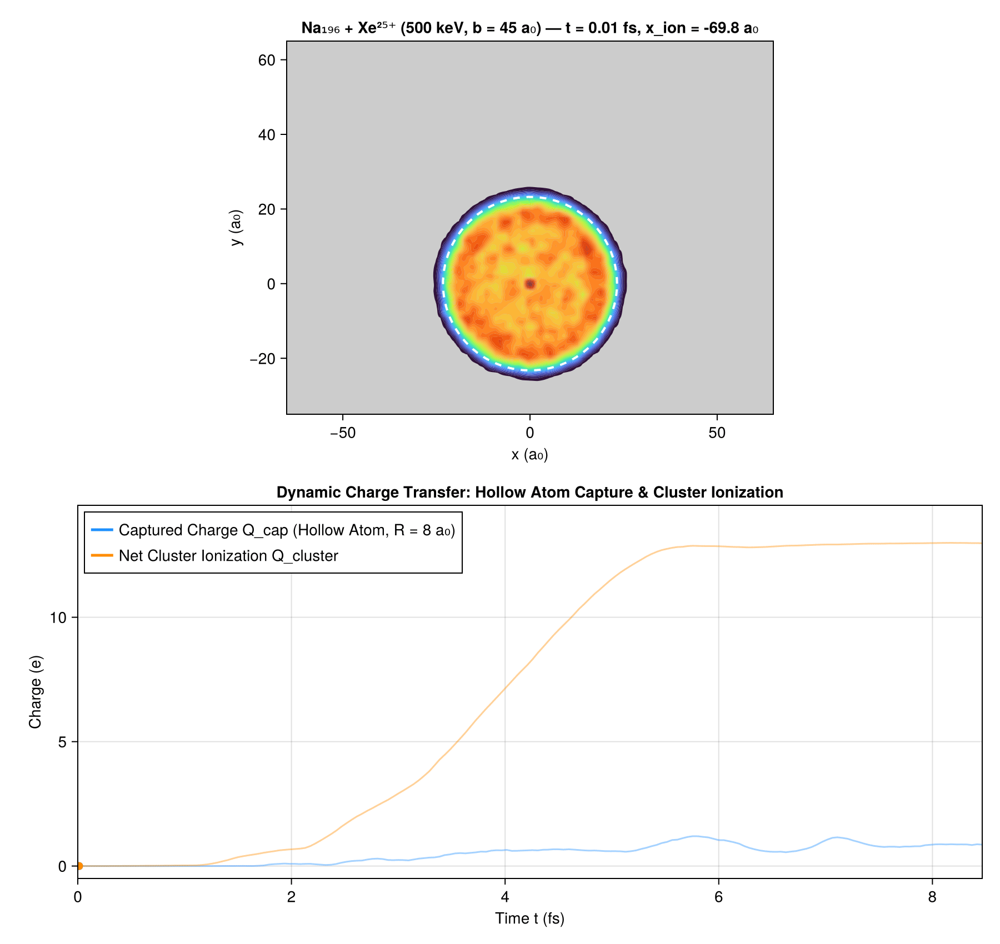
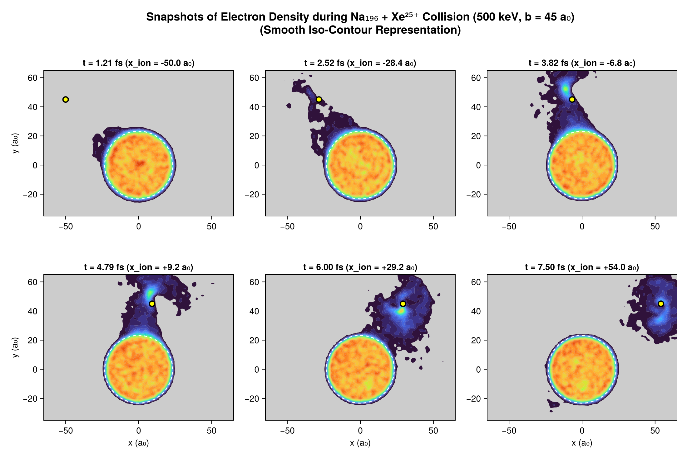
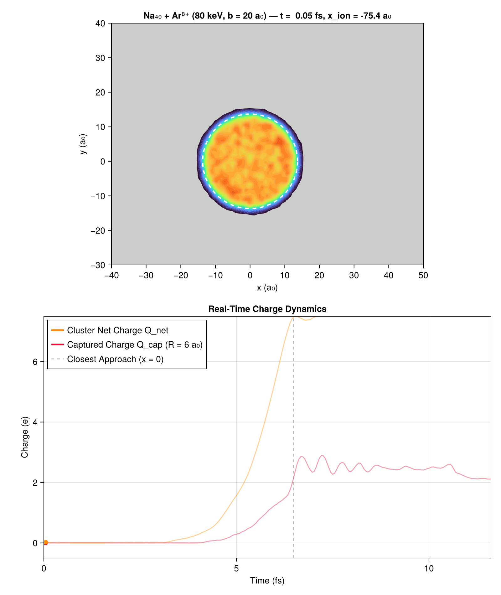
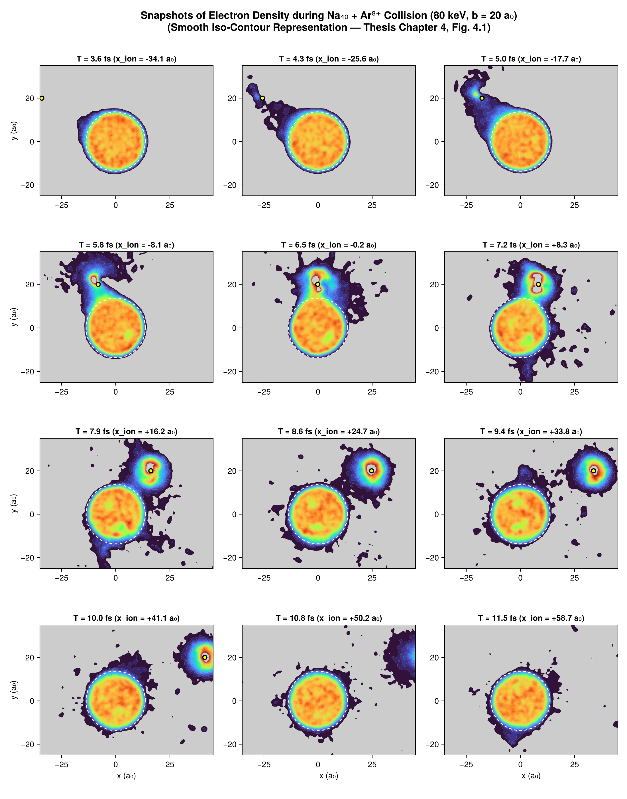
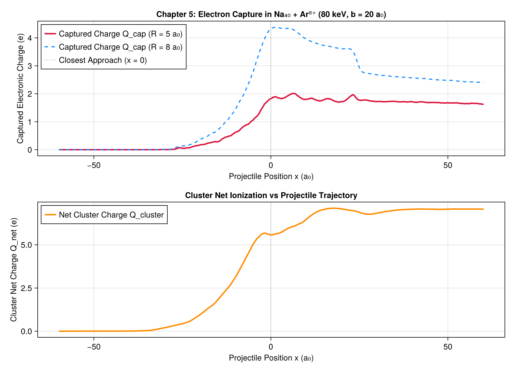

```@meta
CurrentModule = Vlasov
```

# Chapter 5: Peripheral Collisions with Highly Charged Ions

This chapter details the physical phenomenology, modeling, and simulation of **peripheral collisions between sodium clusters and multiply charged ions** ($\text{Xe}^{25+}$, $\text{Ar}^{8+}$), as presented in Chapter 4 of the 1998 thesis and the contemporary Springer 1997 publication.

---

## 1. Physical Motivation: The Rayleigh Critical Charge

A charged metallic cluster becomes unstable when electrostatic Coulomb repulsion overcomes the cluster's cohesive surface energy. For a macroscopic conducting droplet, Lord Rayleigh calculated the classical critical charge:

```math
Q_c(N) \propto N^{1/2}
```

Determining the critical charge of cold, microscopic metallic clusters provides insight into the transition between microscopic quantum mechanics and macroscopic electrostatics.

To produce **highly charged, weakly excited** clusters without fragmenting them through violent frontal collisions, experiments deploy **peripheral collisions** ($b > R_{\text{cluster}}$) using highly charged heavy ions (e.g. $\text{Xe}^{25+}$, $\text{Ar}^{8+}$).

```mermaid
graph LR
    subgraph Collision Geometry
        I["Incoming Multicharged Ion (v_P, impact parameter b)"] -->|"Coulomb Saddle Dip"| P["Closest Approach (x = 0)"]
        P -->|"Exit with Bound Electrons"| D["Outgoing Ion (Hollow Atom State)"]
    end
    subgraph Cluster Response (Na_N)
        C["Valence Electron Cloud"] -->|"Resonant Tunneling / Spillover"| E["Electron Bridge Formation"]
        E -->|"Capture"| D
        E -->|"Continuum Emission"| F["Multi-Ionization Q_net"]
        C -->|"Coherent Dipole Kick"| G["Surface Plasmon Oscillation"]
    end
```

---

## 2. Xenon Peripheral Collision Movie: $\text{Na}_{196} + \text{Xe}^{25+}$ ($500\text{ keV}$, $b = 45\text{ a}_0$)

In the Springer 1997 study (*Dynamics of clusters in collision with multicharged ions*), a high-energy multicharged Xenon ion ($\text{Xe}^{25+}$, $E = 500\text{ keV}$, velocity $v_P = 0.40\text{ a.u.}$) grazes a large sodium cluster $\text{Na}_{196}$ ($R_{\text{cluster}} \approx 22.8\text{ a}_0$) at an impact parameter $b = 45.0\text{ a}_0$.

### Dynamic Animated Film

The animation below shows the 2D cut of the electronic density $\rho(x, y)$ in the collision plane ($z \approx 0$) together with real-time charge tracking:
- **Top panel**: Spatial electron density (turbo colormap: yellow bulk core $n_0 = 0.00373\text{ a.u.}$, red peak, blue halo, grey vacuum) with cluster jellium boundary (dashed white circle) and projectile position (white circle).
- **Bottom panel**: Real-time captured charge $Q_{\text{cap}}$ (within $R = 8\text{ a}_0$ around the ion) and net cluster ionization $Q_{\text{net}}$.



*(Direct MP4 video available at `assets/film_xenon.mp4`)*

### Chronological Snapshots (Reproducing Springer 1997 `xenon40.ps`)

The figure below reproduces the historical 6-panel snapshot sequence from the thesis and Springer 1997 paper:



### Key Physical Phenomena:
1. **Electron Bridge Formation ($t \approx 2.5 - 3.8\text{ fs}$)**:
   As the $\text{Xe}^{25+}$ ion approaches, its massive Coulomb field lowers the potential barrier below the cluster Fermi energy, drawing a dense bridge of valence electrons toward the projectile.
2. **Hollow Atom (*Atome Creux*) Capture ($t \approx 3.8 - 5.0\text{ fs}$)**:
   Electrons are captured into high-$n$ Rydberg orbits around the projectile, forming a transient neutral/partially neutralized "hollow atom" traveling with the ion ($Q_{\text{cap}} \approx 1-1.5\,e$).
3. **Multi-Ionization & Collective Plasmons ($t \ge 6.0\text{ fs}$)**:
   The cluster loses 12 to 13 electrons ($Q_{\text{net}} \approx +13$), leaving a highly charged cold cluster $\text{Na}_{196}^{13+}$. The sudden asymmetric kick triggers a long-lived dipolar surface plasmon oscillation.

---

## 3. Argon Reference Collision: $\text{Na}_{40} + \text{Ar}^{8+}$ ($80\text{ keV}$, $b = 20\text{ a}_0$)

The central multicharged collision examined in Chapter 4 of the 1998 thesis is $\text{Na}_{40} + \text{Ar}^{8+}$:
- Target: $\text{Na}_{40}$ neutral cluster ($r_{\text{jel}} = 13.68\text{ a}_0$).
- Projectile: $\text{Ar}^{8+}$ ion ($M \approx 73,446\text{ a.u.}$, $E = 80\text{ keV}$, velocity $v_P = 0.28\text{ a.u.}$).
- Impact parameter: $b = 20.0\text{ a}_0$ (peripheral, $b / r_{\text{jel}} \approx 1.5$).
- Time step: $\Delta t = 0.5\text{ a.u.}$ ($\approx 0.012\text{ fs}$).

### Animated Film: $\text{Na}_{40} + \text{Ar}^{8+}$



### 12-Panel Snapshot Strip (Reproducing Thesis Fig. 4.1 / `Fsnap1.ps`)

The 12 snapshots below track the deformation of the $\text{Na}_{40}$ valence electron cloud at the exact historical timestamps from $T = 3.6\text{ fs}$ to $11.5\text{ fs}$:



### Charge Evolution and Observables:



### Main Observables:
1. **Captured electronic charge $Q_{\text{cap}}(t)$**:
   Measured via [`enclosed_charge`](@ref) within a sphere of radius $R = 5\text{ a}_0$ or $8\text{ a}_0$ around the ion.
2. **Cluster Net Ionization $Q_{\text{cluster}}(t)$**:
   Deficit of electrons within the cluster volume, leaving the cluster in a net charged state $\text{Na}_{40}^{Q+}$ ($Q_{\text{final}} \approx +6.5$).
3. **Cluster Excitation Energy $E_{\text{exc}}$**:
   Residual electronic internal energy after the projectile exits, dominated by the dipole surface plasmon mode.

---

## 4. Comparison with Over-the-Barrier (OBM / DOBM) and Quantum Models

The thesis benchmarks the semi-classical Vlasov simulations against:
- **Classical Over-The-Barrier Model (OBM)**: predicts electron transfer when the Coulomb saddle point between cluster and ion drops below the Fermi level $\epsilon_F$.
- **Dynamic Over-The-Barrier Model (DOBM)**: accounts for the finite velocity of the projectile and dynamic barrier deformation.
- **Quantum TDLDA calculations** (K. Yabana): confirms that the semi-classical phase-space distribution $f(\vec{r}, \vec{p}, t)$ accurately captures multi-electron transfer rates without spurious quantum suppression.
