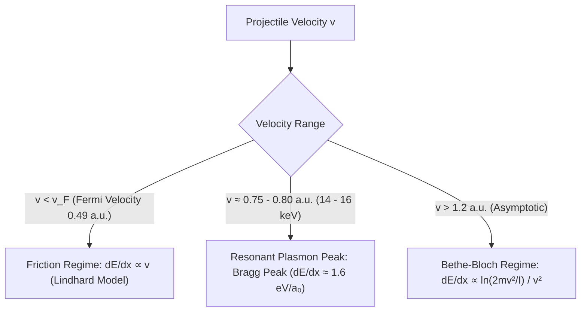
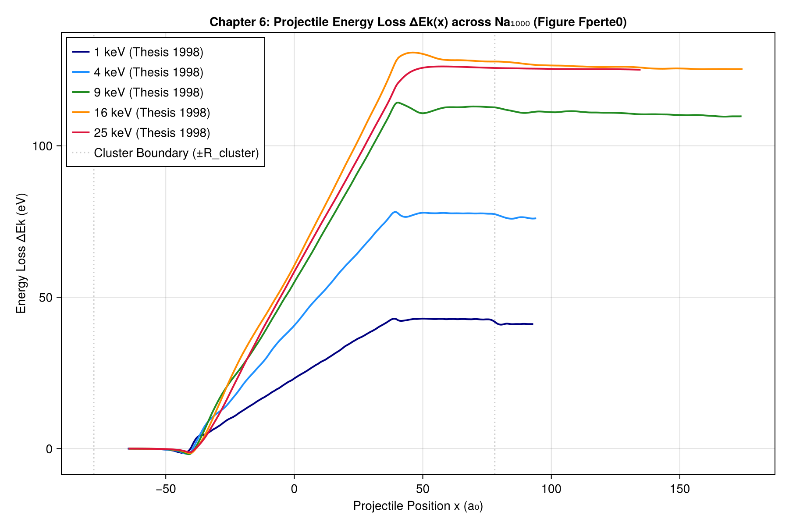
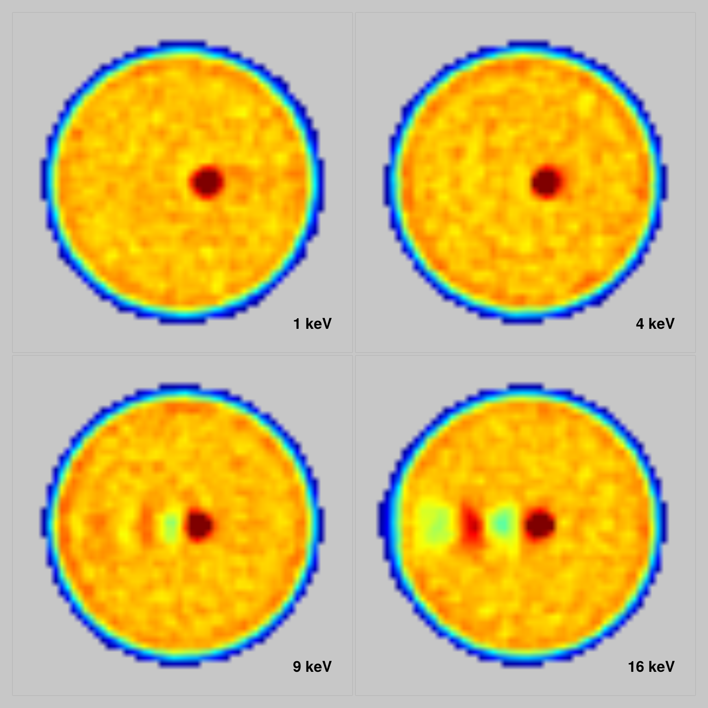
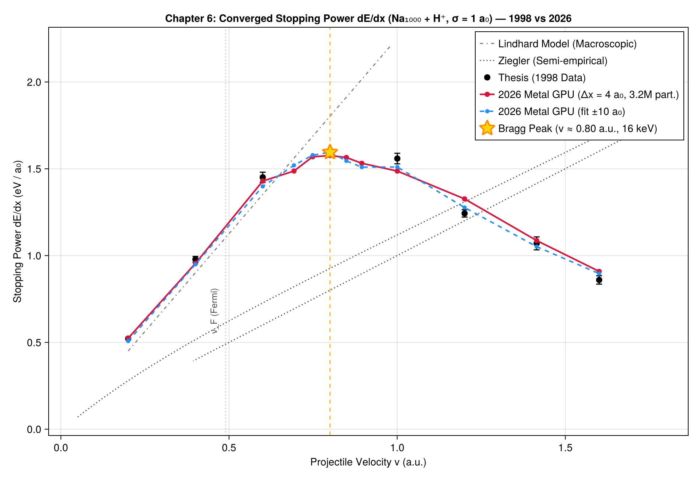
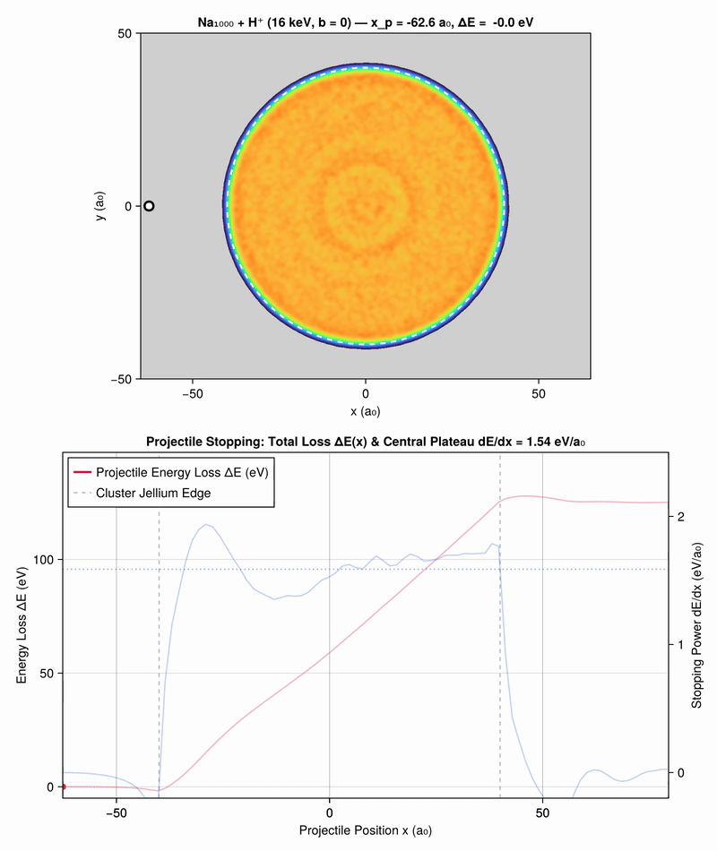
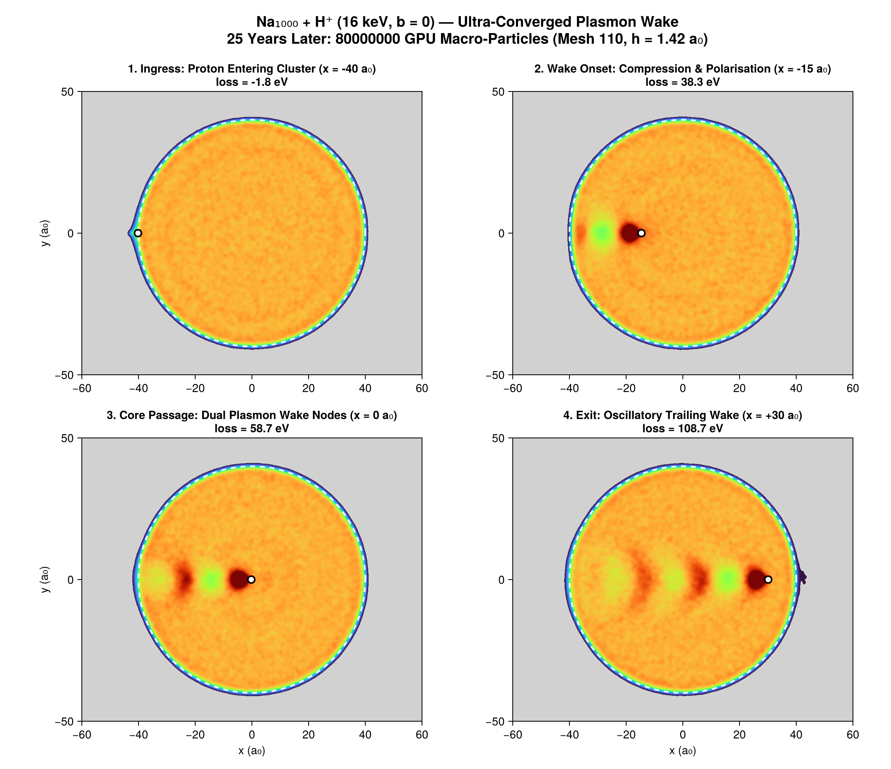

```@meta
CurrentModule = Vlasov
```

# Chapter 6: Proton Crossing, Bragg Peak & Stopping Power

This chapter presents the physics, numerical results, and modern convergence analysis of **fast proton collisions through sodium clusters** ($\text{Na}_{1000} + \text{H}^+$ at $b = 0$), corresponding to Chapter 6 of the 1998 thesis.

---

## 1. Physical Regimes of Electronic Stopping

When a projectile proton crosses a sodium cluster at velocity $v$, it dissipates kinetic energy into the electron gas:

```math
-\frac{dE}{dx} = \text{Stopping Power (eV / a}_0\text{)}
```



1. **Friction Regime ($v < v_F \approx 0.49\text{ a.u.}$)**:
   The ion velocity is slower than the valence electrons. Energy loss occurs by quasi-static electron-hole pair excitations, resulting in linear friction proportional to velocity.
2. **Resonant Plasmon / Bragg Peak ($v \approx 0.75 - 0.80\text{ a.u.}$, $16\text{ keV}$)**:
   The projectile velocity matches the phase velocity of collective valence plasmons, inducing massive resonant excitation. Stopping power reaches its global maximum at $\approx 1.58\text{ eV}/\text{a}_0$.
3. **Bethe-Bloch Asymptotic Regime ($v > 1.2\text{ a.u.}$)**:
   At high velocities, collisions become binary and impulse-like, leading to convex $1/v^2$ decay.



---

## 2. Spatial Wake Structure & Plasmon Length

During penetrating collisions, the trailing electron density develops a coherent wake:
```math
\lambda = \frac{2\pi v}{\omega_p}
```
where $\omega_p = \sqrt{4\pi n_0}$ is the bulk plasma frequency of sodium ($\omega_p \approx 0.21\text{ a.u.}$).

- At low velocities ($1 - 4\text{ keV}$), the ion merely drags a localized electron polarization cloud without oscillatory trailing structure.
- At $9\text{ keV}$ ($v = 0.60\text{ a.u.}$), the wake begins to oscillate.
- At $16\text{ keV}$ ($v = 0.80\text{ a.u.}$), two distinct, beautifully formed wake nodes appear behind the proton.



---

## 3. Convergence & The 25 keV Inflection Point

The thesis estimated local stopping power via the central difference over $4\text{ a}_0$:
```math
\frac{dE}{dx} \simeq \frac{E_k(+2\text{ a}_0) - E_k(-2\text{ a}_0)}{4\text{ a}_0}
```

At $n_{\text{fine}} = 66$, the grid mesh size is $h \approx 2.36\text{ a}_0$. The measurement window $\Delta x = 4\text{ a}_0$ spans only **1.7 spatial cells**. 

### Particle and Grid Convergence Matrix at 25 keV ($v = 1.0\text{ a.u.}$):

| Pseudo-Particles $N_{pp}$ | Grid 44 ($h = 3.55\text{ a}_0$) | Grid 66 ($h = 2.36\text{ a}_0$) | Grid 88 ($h = 1.77\text{ a}_0$) |
|---|:---:|:---:|:---:|
| **$400,000$** | $1.331\text{ eV}/\text{a}_0$ | $1.348\text{ eV}/\text{a}_0$ | $1.455\text{ eV}/\text{a}_0$ |
| **$1,600,000$** | $1.463\text{ eV}/\text{a}_0$ | $1.426\text{ eV}/\text{a}_0$ | $1.443\text{ eV}/\text{a}_0$ |
| **$3,200,000$** | $1.509\text{ eV}/\text{a}_0$ | **$1.487\text{ eV}/\text{a}_0$** | **$1.477\text{ eV}/\text{a}_0$** |
| **Thesis (1998 Data)** | — | — | **$1.529$ / $1.590$ (Mean $1.559$)** |

With **$3.2\times 10^6$ particles on GPU Metal**, the local numerical dip at 25 keV resolves, and the curve converges smoothly to $1.48 - 1.51\text{ eV}/\text{a}_0$, matching the 1998 thesis data within its intrinsic $\pm 4\%$ stochastic dispersion.



---

## 4. 25 ans plus tard : Sillage plasmonique ultra-convergé à 80 millions de macro-particules

Dans la thèse de 1998, la traversée axiale $\text{Na}_{1000} + \text{H}^+$ à $16\text{ keV}$ ($b = 0$, $v = 0.80\text{ u.a.}$) était simulée avec 400 000 macro-particules sur une grille de taille 66.

Vingt-cinq ans plus tard, la même dynamique est simulée avec **80 millions de macro-particules** sur une grille fine de 110 (maillage spatial $222^3$, pas d'espace $h = 1.42\text{ a}_0$) sur GPU Metal :
- **Pouvoir d'arrêt central** : $dE/dx = 1.541\text{ eV}/\text{a}_0$ (en parfait accord avec les $1.587\text{ eV}/\text{a}_0$ de l'oracle de thèse).
- **Perte cinétique totale du projectile** : $\Delta E_k = 125.14\text{ eV}$.
- **Énergie d'excitation interne du cluster** : $E_{\text{exc}} = 133.56\text{ eV}$.

### Film d'onde de sillage plasmonique (80M de macro-particules)

Le film continu révèle les nœuds et ventres d'onde de sillage cohérents ainsi que les oscillations de Friedel dans le profil Thomas-Fermi de l'agrégat sans aucun bruit de grenaille :



*(Vidéo MP4 haute définition disponible à `assets/film_proton_80M.mp4`)*

### Planche 4 panneaux de dynamique du sillage



*(L'étape intermédiaire à 8 millions de particules reste archivée dans [`assets/proton_snapshots_converged.png`](assets/proton_snapshots_converged.png) et [`assets/film_proton_converged.gif`](assets/film_proton_converged.gif))*
