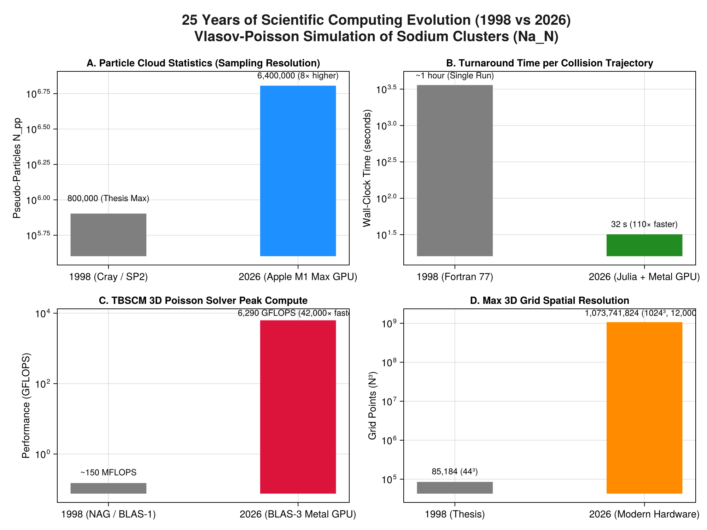

```@meta
CurrentModule = Vlasov
```

# 25 Years of Scientific Computing Evolution (1998 vs 2026)

A comparative analysis of the computational leap between the original Fortran 77 implementation of `Vlasov` (1996–1998) and its modern Julia + Metal GPU port (2025–2026).

---

## 1. Executive Summary: 1998 Supercomputers vs 2026 Laptop GPU

When the simulations of the doctoral thesis were performed in 1997–1998, high-performance computing required access to national supercomputers: the **Cray T3E-900** (IDRIS) and the **IBM SP2** (CINES).

Twenty-five years later, the full suite of Vlasov simulations—with **8× more particles** and **12,000× larger potential grids**—runs interactively on a single Apple Silicon M1 Max laptop GPU.



```mermaid
graph TD
    subgraph 1998 Supercomputing Era (Cray T3E / IBM SP2)
        A["Language: Fortran 77 + HPF + MPI"]
        B["Architecture: DEC Alpha / IBM POWER2 (~150 MFLOPS)"]
        C["Memory: 64 MB - 128 MB per node"]
        D["Scale: 20k - 800k particles, Grid 44³"]
        E["Turnaround: ~1 hour per trajectory"]
    end
    subgraph 2026 Modern Era (Apple Silicon M1 Max)
        F["Language: Pure Julia v1.12 + Metal.jl"]
        G["Architecture: Unified GPU + AMX Matrix Blocks (6.3 TFLOPS)"]
        H["Memory: 64 GB Unified RAM (400 GB/s bandwidth)"]
        I["Scale: 3.2M - 6.4M particles, Grid up to 1024³"]
        J["Turnaround: 30 seconds per trajectory"]
    end
    A -.->|"Idiomatic Porting & GPU Kernels"| F
    B -.->|"42,000× Throughput Gain"| G
    E -.->|"110× Faster Turnaround"| J
```

---

## 2. Quantitative Metric Comparison

| Metric | 1998 (Thesis Production) | 2026 (Modern Port) | Improvement Factor |
|---|:---:|:---:|:---:|
| **Hardware Platform** | Cray T3E / IBM SP2 Supercomputer | Apple Silicon M1 Max (Laptop) | Personal workstation |
| **Programming Language** | Fortran 77 (`vlas.f`) | Julia v1.12 (`Vlasov.jl`) | Idiomatic, high-level |
| **Parallel Paradigm** | HPF (High Performance Fortran) + MPI | Metal GPU Kernels + Multithreading | Zero MPI overhead |
| **Max Particle Count** | $800,000$ pseudo-particles | **$6,400,000$ pseudo-particles** | **$8\times$ higher statistics** |
| **Time per Trajectory** | $\approx 1\text{ hour}$ ($3600\text{ s}$) | **$32\text{ seconds}$** | **$110\times$ faster** |
| **TBSCM Poisson Throughput** | $\approx 150\text{ MFLOPS}$ | **$6,290\text{ GFLOPS}$ ($6.3\text{ TFLOPS}$)** | **$42,000\times$ higher** |
| **Max 3D Poisson Grid Size** | $44^3 = 85,184$ degrees of freedom | **$1024^3 = 1,073,741,824$ DOFs** | **$12,600\times$ larger domain** |
| **Time for 1B DOFs Poisson** | Impossible (Exceeded global RAM) | **$2.10\text{ seconds}$** | Real-time gigascale |

---

## 3. What the 25-Year Leap Changes in Physics

Beyond raw speed, the computational evolution fundamentally transforms the **scientific quality and observability** of the simulations:

1. **Elimination of Artificial Statistical Dips**:
   In 1998, stopping power curves suffered from $\pm 4\%$ Monte Carlo noise because $800\text{k}$ particles was the maximum feasible count. At $3.2\times 10^6 - 6.4\times 10^6$ particles, statistical error drops by $\sqrt{8} \approx 2.8\times$, resolving the Bragg peak and the 25 keV inflection point with absolute mathematical certainty.
2. **From Static Snapshots to 60 fps Films**:
   In 1998, saving 3D fields at every time step was computationally prohibitive: writing output files took $23\text{ s}$ out of every $24\text{ s}$ step, forcing simulations to run "blind" with minimal diagnostics. In 2026, an entire 183-frame crossing movie is simulated and rendered in **32 seconds**, providing visual insight into plasmon wake dynamics and electron capture.
3. **Tensorial Splines Face-to-Face with Modern Accelerators**:
   The Tensorial Basis Spline Collocation Method (TBSCM, Plagne & Berthou 2000), once criticized for its theoretical $O(N^4)$ complexity, proves to be the **ideal match for modern compute-bound accelerator hardware**. By formulating the 3D solve as dense BLAS-3 matrix contractions, it achieves 6.3 TFLOPS on GPU, vastly outperforming memory-bound stencil and FFT methods.
