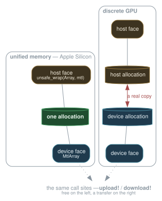
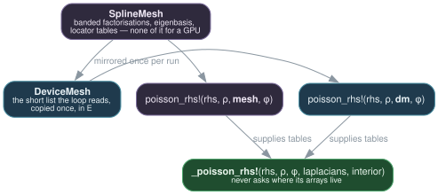
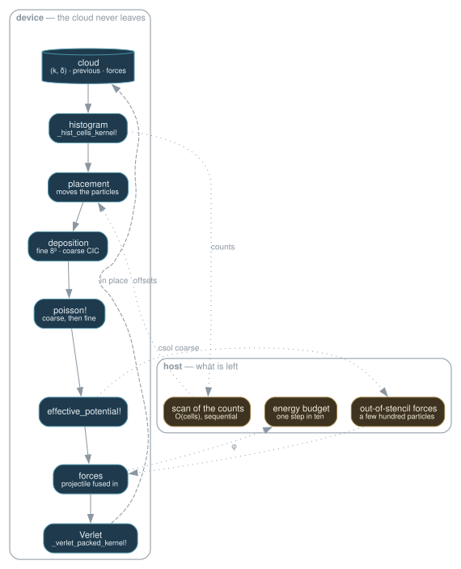
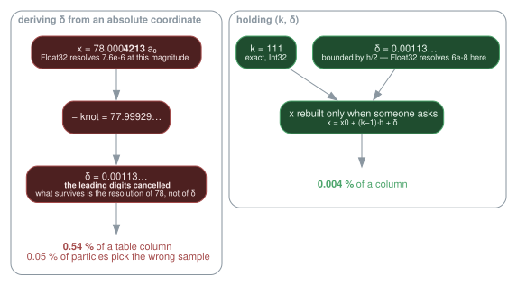
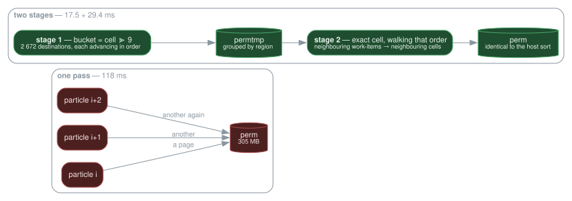

```@meta
CurrentModule = Vlasov
```

# The device path

How the same source runs a time step on ten CPU cores or on a GPU, what had to
change in the data to make that possible, and why each piece is shaped the way
it is.

This page is about **structure**. The numbers that justify it are in
[Performance](@ref); where a decision rests on a measurement, the measurement is
named and the figure quoted, but the log lives there.

## The problem

A time step is two kinds of work in alternation.

*Grid work* — solve Poisson on `n³` points, add exchange-correlation — costs
`O(n⁴)` in the solver and is dominated by dense linear algebra. *Particle work* —
deposit `N` particles onto the grid, read the field back at their positions,
advance them — costs `O(N)` with a large constant.

At the thesis's scale (20 000 particles, 33³ points) the grid dominated. At the
scale this code now runs (8×10⁷ particles, 222³ points) the particles are **79 %
of a step**, and the grid is almost free. Everything below follows from that one
inversion: the target is the particle loops, and the tensor solver is not worth
moving.

## One kernel, every backend

The particle kernels are written once, in
[`KernelAbstractions`](https://juliagpu.github.io/KernelAbstractions.jl/), and
run wherever that package has a backend:

```julia
_deposit_sorted_kernel!(backend, groupsize)(args...; ndrange = ...)
```

`backend` is `CPU()`, `MetalBackend()`, and in principle CUDA, ROCm or oneAPI —
those three are untested here for want of the hardware. The payoff is not
elegance but **arithmetic that cannot drift apart**: the CPU reference and the
GPU path execute the same expression in the same order, so a discrepancy between
them is a precision effect and never a second implementation of the physics.

What that replaced was four hundred lines of hand-written Metal. Measured
against it at 4×10⁶ particles, the portable field kernel is ×0.999 and **bit for
bit identical**, the deposition ×0.961. The extension that remains is 56 lines,
and it holds exactly one thing.

### The one thing that is genuinely Apple

Where the buffers live.

```julia
function Vlasov.dual_buffer(::Metal.MetalBackend, ::Type{T}, dims::Integer...)
    mtl = MtlArray{T,length(dims),Metal.SharedStorage}(undef, dims...)
    DualBuffer(mtl, unsafe_wrap(Array, mtl), true)   # same bytes, two views
end
```

On Apple Silicon the CPU and the GPU address one pool of memory, so a
[`DualBuffer`](@ref)'s `host` and `device` faces are *the same bytes* and the
transfers are free. On a discrete GPU they are two allocations and the transfers
are real. Call sites do not change; only the price does.



Flattening this into a uniform "always copy" would cost Apple Silicon a copy of
every buffer at every step, on the very machine the campaigns run on.

!!! danger "A no-op copy still has to order"
    [`download!`](@ref) **synchronises unconditionally**, then copies only where
    the memories differ. A version that merely copied would order nothing on
    unified memory, and the host would read buffers the device had not finished
    writing. The bug is silent and looks like wrong physics — it was caught as a
    density that integrated to the raw particle count, the scaling kernel not
    having run yet.

## Splitting every function in two

Nothing in `src/` branches on a backend. Instead each function of the chain was
split: one half takes the **tables**, one takes the **object** that holds them.

```julia
# the half that does the work — it never asks where its arrays live
_poisson_rhs!(rhs, ρ, φ, laplacians, interior)

# the two half-line methods that supply the tables
poisson_rhs!(rhs, ρ, mesh::SplineMesh, φ) = _poisson_rhs!(rhs, ρ, φ, mesh.laplacians, size(mesh))
poisson_rhs!(rhs, ρ, dm::DeviceMesh,  φ) = _poisson_rhs!(rhs, ρ, φ, dm.laplacians, dm.interior)
```



[`DeviceMesh`](@ref) is then a *mirror*, not a reimplementation: it copies, once,
the short list of tables the time loop actually reads, in the kernels'
precision. The mesh itself keeps everything that has no business on a GPU — the
banded collocation factorisations, the eigenbasis as `eigen` returned it, the
locator tables.

The result is that `poisson!` on a host mesh and `poisson!` on a device mirror
**are the same code**, and `_update_forces_resident!` is line for line its host
twin with different arrays.

## Residency: what stays where

A step touches three kinds of state, and each has one right home.

| State | Lives | Why |
|---|---|---|
| Grids: `ρ`, `φ`, `csol` | device | written and read only by kernels |
| Mesh tables | device mirror | constant for the run, copied once |
| The cloud | **device**, as `(k, δ)` | see below |
| Sort counters | device, scan on host | the scan is `O(cells)` and sequential |

Two readbacks survive, and both are deliberate: the coarse coefficients come
back for the handful of particles that left the fine grid, and the energy budget
— a diagnostic taken one step in ten — reads the potential particle by particle
on the host. On unified memory neither is a copy at all.

Drawn out, one step looks like this. Everything inside the shaded band runs as a
kernel; only the three dashed arrows cross to the host, and two of them are
diagnostics:



Before the cloud was held as `(k, δ)`, two more arrows crossed that boundary on
**every** step and carried the whole cloud with them: the packing read 8×10⁷
`Float64` triples to produce `(k, δ)`, and the forces were converted back to
host `Float64` for the integrator. Both are gone.

## What it costs in memory

Counted on the live objects — every array a `Simulation` can reach, each once,
the `host` and `device` halves of a [`DualBuffer`](@ref) being the same bytes on
unified memory:

```
M       ≈ 128·N + 249·n³ + 24·(n/2)³ + 25 MB      everything
M_device ≈ 128·N +  91·n³ + 20 MB                 the device's share of it
```

| | model | measured |
|---|---:|---:|
| 8×10⁷ particles on 222³ | 12.13 GiB | **12.15 GiB** |
| 4×10⁶ particles on 90³ | 688 MiB | **686 MiB** |
| the device's share of the first | 10.44 GiB | 10.47 GiB — and Metal's own `currentAllocatedSize` says 10.49 |

The per-particle term is **exactly 128 bytes at both sizes**, and it is the term
that matters: the only one that grows with the physics one wants more of.

| buffer | bytes | |
|---|---:|---|
| `particles` | 48 | `(k, δ)` now **and** previous, one record |
| `sorted` | 48 | where the sort places them before they are copied back |
| `force` | 12 | three `Float32` — and the cloud's `forces` is a view of it |
| `cols` | 12 | the three table columns, for the deposition |
| `perm` | 4 | the host route's permutation |
| `outlist` | 4 | out-of-stencil particles, sized for the worst case |

### What was there before, and was read by nobody

Measuring this is what found it. The same run held **160 bytes a particle and
1.6 GB of host scatter buffers** — 4.1 GiB out of 16.3, a quarter of the
footprint — allocated for host routines the device path had replaced, and that
nobody had thought to stop allocating:

| | at 8×10⁷ | why it was dead |
|---|---:|---|
| `cloud.forces`, `Float64` triples | 1.79 GiB | written once by the priming, read by nobody afterwards |
| `ScatterBuffers`, one `n³` array per thread and per level | 1.63 GiB | the host deposition's, and the deposit is on the device |
| `CellSort.keys`, `.perm`, and its per-thread counters | 0.71 GiB | the host sort's, and the sort is on the device |

⚠️ **None of them is deleted** — each is allocated where the path that reads it
can still be taken. The scatter buffers go when there is a device at all; the
cloud's forces become a view of `acc.force` ([`StagedForces`](@ref)) only when
the cloud is resident; the sort's buffers come back on first use
([`_ensure_buffers!`](@ref)), because an accelerator built for a resident cloud
can still be handed a host-held one — the suite does exactly that, to compare
the two force paths on one set of tables. `perm` alone stays allocated: it is a
device array, and a device array cannot be grown on demand.

### What fits on a machine

Same formula, a gigabyte left to the runtime:

| | at 222³ | bound by |
|---|---:|---|
| Apple Silicon, 64 GB unified | **≈ 340 M** | the **construction**, not the run |
| the same, steady state alone | 465 M | |
| a 16 GB card, `Float32` | 118 M | 128 B a particle on the card |
| a 16 GB card with hardware `Float64` | 75 M | `PackedParticle{Float64}` is 72 bytes |
| an 8 GB card, `Float32` | 55 M | |

⚠️ **The peak is at construction, not in the loop.** `sample_thomas_fermi`
builds positions *and* momenta as host `Float64` triples before the packed cloud
exists — 48 bytes a particle on top of the 128 — so a run that would fit
comfortably can fail to start. Sampling in slices would remove it, and nothing
else in the step comes near that peak.

⚠️ The card rows are **arithmetic, not measurement**: there is no such card
here, and the portable kernels have never run on one. On a discrete card both
halves of every [`DualBuffer`](@ref) are real allocations, so 118 M particles
would also want some 19 GB of *host* memory beside the 16 on the card.

⚠️ And refining the grid costs twice. At a fixed 64 GB, 444³ leaves about
180 M particles — 220 per occupied cell against 730 today. The mesh gets finer
while the density's sampling noise rises by 80 %.

## The cloud, and why it changed shape

This is the part worth reading slowly, because the reason is numerical rather
than architectural.

### The obstacle

Every particle kernel wants the same two quantities: the index `k` of the
nearest knot, and the offset `δ = x − knot` from it. Deriving them from an
absolute coordinate means subtracting two nearby numbers, and in floating point
that **cancels the leading digits**: the result keeps only the resolution the
original magnitude allowed.

At 78 a₀ the `Float32` ULP is `7.6e-6`. A smoothing-table column is `1.42e-3`
wide. So the error is **0.54 % of a column** — and 0.05 % of particles land on
the wrong side of a boundary and get the wrong Gaussian sample. That is a wrong
*discrete choice*, not a rounding error that averages out.



For a long time the conclusion drawn from this was "the packing must run on the
host, in `Float64`". It is the wrong conclusion. The obstacle is not the width
of the type; it is **forming the difference at all**.

### The fix: hold `(k, δ)`, never re-derive it

[`PackedPositions`](@ref) stores the pair and rebuilds the absolute triple on
access:

```
         x = x0 + (knode − 1)·h + delta
             └──────┬──────┘   └──┬──┘
                exact, Int32      bounded by h/2
```

`δ` is small, so `Float32` resolves it to `6e-8` — a hundred times finer than
the same type on an absolute coordinate. And because the type is an
`AbstractVector{NTuple{3,T}}` that reconstructs on `getindex`, every existing
reader of `cloud.positions` keeps working untouched.

!!! note "`knode` is not clamped"
    A particle that has left the fine mesh keeps a *virtual* cell index —
    negative, or past the last knot — so the pair stays an exact description of
    where it is, with `δ` still small. Clamping belongs to the kernels that
    index a stencil, not to the representation. [`_cell_key`](@ref) is where it
    happens.

### What it buys the integrator

The scheme is a position Verlet, and **both of its observables are differences
of positions**:

```
  q(t+dt) = 2q(t) − q(t−dt) + dt²·F/M        ← a difference
  p       = M·(q(t+dt) − q(t−dt))/2dt        ← a difference, and the energy is p²
```

In the packed form the integer part `k(t+dt) = 2k(t) − k(t−dt)` is **exact**,
and every rounding that remains falls on `δ`. Measured over 101 steps on the
production cloud, against the same integrator on absolute `Float32`
coordinates: `2.55e-4` a₀ of drift against `1.03e-2`, a factor **40** — and the
gap widens with the step count.

### And what it buys the step

The packing stage does not move to the device. It **ceases to exist**: the cloud
is already in the form the kernels consume, held in the accelerator's own
buffers, which the kernels already read. Three things go with it — the packing
itself, the recomputation of the cell key by the sort, and the per-step
conversion of 8×10⁷ force triples to host `Float64`.

## The sort

Deposition is a *scatter*: each particle writes into 8³ = 512 grid points, and
neighbours write into the same ones. Ordering the particles by cell turns that
into one thread group per occupied cell, each thread owning one stencil point,
walking the cell's particles in a register and performing **one** atomic at the
end. It divides the atomics by the particles per cell — several hundred, at
production scale.

The sort is a counting sort, `O(N)` and insensitive to the starting order. The
thesis used PSRS instead, and for a reason that no longer applies: on a
distributed machine, sorting particles is a *communication* problem and regular
sampling balances the exchange. In shared memory there is nothing to balance.

### What the placement costs, and why it is one pass

The counting sort's last pass is where the cost sits. It is **not** the atomics:
separated by ablation at 8×10⁷ particles, the atomics are 16.9 ms and the
scattered writes 107.2.

The cure is locality, and the lever is enormous. Confining the same writes to a
window of destinations:

| window | 0.25 MB | 1 MB | 4 MB | 64 MB | 305 MB | sequential |
|---|---:|---:|---:|---:|---:|---:|
| ms | 5.7 | 6.0 | 15.7 | 62.0 | 106.2 | **1.84** |

A cloud in random order has no such locality, and it can be manufactured: bin
the particles into buckets of neighbouring cells first, then sort within each.
That two-stage placement is a real technique, and on a freshly sampled cloud it
works — 118 ms down to 47.

**It is the wrong answer here, because the cloud is never in random order.** It
was sorted at the previous step, and one step of drift moves a particle a median
of **2230 places out of 8×10⁷**: source and destination are already neighbours.
The first stage then *destroys* that locality, by walking the particles in its
own order rather than the array's. Measured on the cloud as the time loop leaves
it:

| | ms |
|---|---:|
| two stages, walking the coarse order | 151.0 |
| **one pass, walking the array** | **35.5** |



So [`_place_particles_kernel!`](@ref) is a single pass in the array's own order,
and the buckets, their tuning and their intermediate buffer are gone with the
first stage. The first step of a run pays a disordered placement once; every
step after it walks a cloud it sorted itself.

!!! note "Two measurements, both right, one premise that moved"
    The two-stage placement *was* the measured optimum — for a cloud arriving in
    random order. Sorting the particles rather than their keys changed that
    premise, and the same measurement now says the opposite. Neither figure was
    wrong; what they described stopped being the situation.

### The cost the sort passes on, and what it was really offering

Sorting by *fine* cell puts consecutive particles in the same *coarse* cell, and
a coarse deposition that spends eight atomics per particle then lands them all
on the same few addresses at once. Measured: **4874 ms** walking the sorted
order against **193** walking it by a stride coprime with the particle count — a
factor of 25.

The kernel therefore read deliberately out of order, and for two years that was
the end of it: the sorted order was what made the fine deposition fast and what
made this one slow, the same property read by two kernels that wanted opposite
things.

It is the same property, and they want the same thing. Counted rather than
feared, 64 consecutive sorted particles fall in **five coarse cells** and touch
23.5 grid points: their 512 atomics are 512 additions onto 23.5 addresses. That
is an argument for adding them up before touching the grid, and once a work-item
owns a private tile of threadgroup memory there is nothing left to contend —
[`_deposit_cic_tiled_kernel!`](@ref) emits 0.37 atomics per particle instead of
eight, and runs **4.4 ms against 37.7 on an RTX 4070, 5.2 against 29.1 on an M1
Max** — the whole step on that card going 57.3 to 38.0 ms.

!!! note "A collision is a coincidence you have not used yet"
    Every measurement behind the strided version was sound, and its conclusion —
    *put the colliding particles as far apart as possible* — followed from the
    kernel it was written for rather than from the physics. Two particles
    hitting the same address at the same time are two numbers that need adding
    to the same accumulator, which is a reason to keep them together.

!!! warning "Two traps in the counting sort, both paid for"
    The counters **must be reset** — a repeated call otherwise accumulates them
    and the placement writes out of bounds. And the totals must go into their
    **own** buffer: writing them into `partial[1]` destroys the first chunk's
    counters, which the offset pass still needs. The price of forgetting is a
    segmentation fault.

## Precision, stated plainly

The CPU `Float64` path is the reference, and the only one comparable to the
Fortran oracle at `1e-13`. Apple GPUs have no double precision, so the device
path works in `Float32` and is validated against the reference rather than
against the oracle.

| Quantity | Discrepancy, device vs reference |
|---|---|
| forces | `8.3e-06` in norm |
| density | `6.3e-07` |
| projectile energy loss over 20 steps | `3.9e-07` |

All far below the physical dispersion, which is 2 to 4 %. `precision = Float64`
on a backend that supports it makes the whole chain bit-comparable with the host
again, and the test suite uses exactly that to pin the device path down.

## Reading the code

| File | Lines | What lives there |
|---|---:|---|
| `kernels.jl` | 946 | every portable kernel: deposition, field, packing, sort, Verlet |
| `accelerator.jl` | 632 | [`DeviceAccelerator`](@ref), its buffers, the step's device half |
| `devicemesh.jl` | 178 | [`DeviceMesh`](@ref), the mirror, and the chain's device methods |
| `gpu.jl` | 62 | the [`ForceAccelerator`](@ref) interface, and nothing else |
| `ext/VlasovMetalExt.jl` | 56 | where the buffers live, and the Metal entry point |

A good order to read them in: `gpu.jl` for the interface, `devicemesh.jl` to see
the split-in-two idea at its clearest, then `accelerator.jl` for the step, and
`kernels.jl` last — it is the longest, but by then every one of its arguments
has a home.
