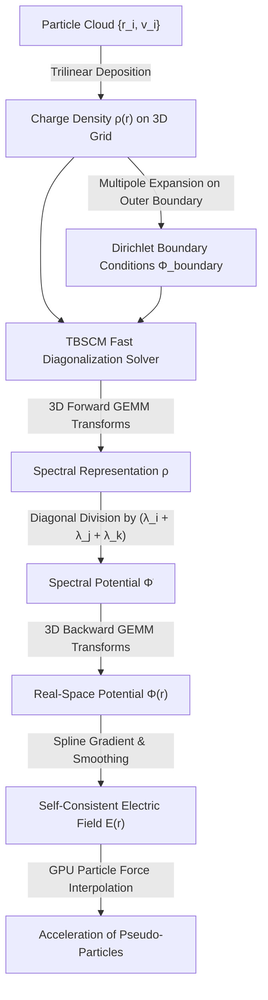
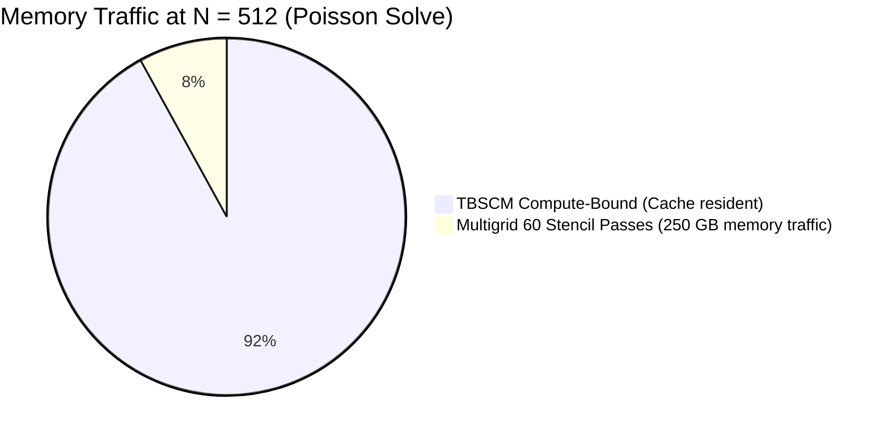

```@meta
CurrentModule = Vlasov
```

# The TBSCM Poisson Solver

A complete technical monograph on the **Tensorial Basis Spline Collocation Method (TBSCM)**, developed by L. Plagne and J.-Y. Berthou (*J. Comput. Phys.* **157**(2), 419–440, 2000), and its realization on modern computing architectures (Apple Silicon M1 Max AMX and Metal GPU).

---

## 1. Problem Statement & Mathematical Framework

In the semi-classical Vlasov-Poisson description of metallic clusters, electrons interact collectively through the self-consistent Hartree potential $\Phi(\mathbf{r})$ satisfying Poisson's equation:

```math
\nabla^2 \Phi(\mathbf{r}) = -4\pi \rho(\mathbf{r}), \qquad \mathbf{r} \in \mathbb{R}^3
```

with open vacuum boundary conditions:

```math
\lim_{|\mathbf{r}| \to \infty} \Phi(\mathbf{r}) = 0
```

The computational domain is a three-dimensional Cartesian box $\Omega = [-L_x, L_x] \times [-L_y, L_y] \times [-L_z, L_z]$.



---

## 2. One-Dimensional Hermite Splines & Collocation

### Basis Functions
On each axis $x \in [-L, L]$, a sequence of $K$ knots $\{x_k\}_{k=1}^K$ defines a partition. The approximation space consists of $C^1$-continuous cubic splines. At each knot $x_k$, two Hermite basis functions are assigned:
- **Value basis** $u_k(x)$: satisfies $u_k(x_j) = \delta_{kj}$ and $u_k'(x_j) = 0$.
- **Slope basis** $s_k(x)$: satisfies $s_k(x_j) = 0$ and $s_k'(x_j) = \delta_{kj}$.

The total number of degrees of freedom is $N = 2K$.

```
   u_k(x) [Value]                     s_k(x) [Slope]
       1.0 ─┐                              0.5 ─┐   /\
            │  /\                               │  /  \
            │ /  \                              │ /    \
       0.0 ─┴──────┴─────             0.0 ──────┴/──────\───────
           x_{k-1} x_k x_{k+1}                  x_{k-1} x_k x_{k+1}
```

### Collocation Discretization
Collocation enforces the differential equation at $2K$ specific collocation points $\{\xi_m\}$:
```math
\sum_{j=1}^{2K} c_j B_j''(\xi_m) = f(\xi_m), \qquad m = 1, \dots, 2K
```
In matrix form:
```math
A \, \mathbf{c} = \mathbf{f}, \qquad \mathbf{u} = S \, \mathbf{c}
```
where $S_{mj} = B_j(\xi_m)$ is the banded value collocation matrix, and $A_{mj} = B_j''(\xi_m)$ is the banded second-derivative matrix. Both $S$ and $A$ have bandwidth 7 (or 5 for uniform spacing), allowing factorizations in $O(N)$ time.

### Generalized Eigenvalue Decomposition
Eliminating the spline coefficients $\mathbf{c} = S^{-1} \mathbf{u}$ yields the discrete 1D differential operator:
```math
\mathcal{L}_{1D} \, \mathbf{u} = (S^{-1} A) \, \mathbf{u}
```
The operator $S^{-1} A$ possesses a **strictly negative, real spectrum** $\Lambda = \mathrm{diag}(\lambda_1, \dots, \lambda_N)$ with real eigenvectors $V$:
```math
S^{-1} A = V \, \Lambda \, V^{-1}
```
This property is verified at construction in [`DiagonalizedOperator`](@ref).

---

## 3. Three-Dimensional Tensor Decomposition (TBSCM)

Because the 3D Laplacian is separable in Cartesian coordinates:
```math
\nabla^2 = \frac{\partial^2}{\partial x^2} \otimes I_y \otimes I_z + I_x \otimes \frac{\partial^2}{\partial y^2} \otimes I_z + I_x \otimes I_y \otimes \frac{\partial^2}{\partial z^2}
```
the 3D discrete operator factors into a Kronecker sum:
```math
\mathcal{L}_{3D} = \mathcal{L}_x \otimes I \otimes I + I \otimes \mathcal{L}_y \otimes I + I \otimes I \otimes \mathcal{L}_z
```

Using the 1D spectral decompositions $\mathcal{L}_d = V_d \Lambda_d V_d^{-1}$, the 3D Poisson equation $\mathcal{L}_{3D} \Phi = \rho$ diagonalizes completely:

```
               TBSCM 3D Tensor Contraction Pipeline
  ┌─────────────────────────────────────────────────────────────┐
  │ 1. Forward Transforms along each dimension:                 │
  │    X₁ = V_x⁻¹ · ρ                                           │
  │    X₂ = V_y⁻¹ · X₁                                          │
  │    X₃ = V_z⁻¹ · X₂   ──>   ρ̃ = X₃                          │
  ├─────────────────────────────────────────────────────────────┤
  │ 2. Diagonal Spectral Division (Element-wise):               │
  │    Φ̃_{ijk} = ρ̃_{ijk} / (λ_i^x + λ_j^y + λ_k^z)              │
  ├─────────────────────────────────────────────────────────────┤
  │ 3. Backward Transforms along each dimension:                │
  │    Y₁ = V_x · Φ̃                                             │
  │    Y₂ = V_y · Y₁                                            │
  │    Y₃ = V_z · Y₂     ──>   Φ = Y₃                          │
  └─────────────────────────────────────────────────────────────┘
```

Each forward and backward transformation along axis $d$ is a dense matrix-matrix multiplication (GEMM) of size $(N^2 \times N) \times (N \times N)$, executing at the hardware's peak FLOP rate.

---

## 4. Why TBSCM Beats FFT and Multigrid on Modern Hardware

In theoretical textbooks, TBSCM's operation count ($12 N^4$ FLOPs for an $N \times N \times N$ grid) is often labeled "asymptotically non-optimal" compared to Multigrid ($O(N^3)$) or FFT ($O(N^3 \log N)$). 

However, on modern memory-constrained architectures, **arithmetic throughput dwarfs memory bandwidth** (*The Memory Wall*):

| Metric | TBSCM (BLAS-3 GEMM) | Multigrid (Stencil) | FFT (Hockney Open Boundaries) |
|---|:---:|:---:|:---:|
| **Arithmetic Intensity** | **$O(N)$ FLOPs / byte** (High) | $\approx 0.25$ FLOPs / byte (Low) | $\approx 1.0$ FLOPs / byte |
| **Memory Bottleneck** | Compute-bound (Runs at Peak) | **Memory-bandwidth bound** | Strided memory transposes |
| **Open Boundary Box Size** | **$N \times N \times N$** | $N \times N \times N$ | **$(2N) \times (2N) \times (2N)$ ($8\times$ size!)** |
| **Apple M1 Max GPU Rate** | **$6,290\text{ GFLOPS}$ (6.3 TFLOPS)** | $\approx 50\text{ GFLOPS}$ (streaming) | $\approx 300\text{ GFLOPS}$ |
| **Time at $N = 256$ ($16.8\text{M}$ pts)**| **$42\text{ ms}$** | $42\text{ ms}$ | $350\text{ ms}$ |
| **Time at $N = 1024$ ($1.07\text{B}$ pts)**| **$2.10\text{ seconds}$** | $\approx 3.6\text{ seconds}$ | **OOM (> 68 GB RAM required)** |



---

## 5. Two-Level Nested Grid Hierarchy for Open Boundaries

To represent the isolated cluster in infinite vacuum without wastefully refining empty space, `Vlasov.jl` implements a nested two-level grid structure ([`NestedMeshes`](@ref)):

```
  ┌─────────────────────────────────────────────────────────────┐
  │ Coarse Mesh (Vacuum, Outer Box, radius R_box)              │
  │                                                             │
  │        ┌─────────────────────────────┐                      │
  │        │ Fine Mesh (Cluster Core)    │                      │
  │        │ radius R_cluster            │                      │
  │        │ Holds pseudo-particles      │                      │
  │        │ High spatial resolution h   │                      │
  │        └─────────────────────────────┘                      │
  │                                                             │
  │ Evaluates Multipoles (Q_lm) on boundary                     │
  └─────────────────────────────────────────────────────────────┘
```

1. **Inner Fine Grid**: covers the physical cluster radius $R_{\text{cluster}}$ where pseudo-particles reside and nonlinear Vlasov dynamics occur ($h = 1.77 - 2.36\text{ a}_0$).
2. **Outer Coarse Grid**: covers the surrounding vacuum box $R_{\text{box}} \approx 3 R_{\text{cluster}}$, providing multipole expansion boundary conditions $\Phi(\partial \Omega_{\text{outer}})$.
3. **Boundary Lifting**: Coarse grid values are interpolated onto the 6 faces of the fine box, and lifted into the fine grid Poisson right-hand side via [`boundary_from_coarse!`](@ref) and [`poisson_rhs!`](@ref).
